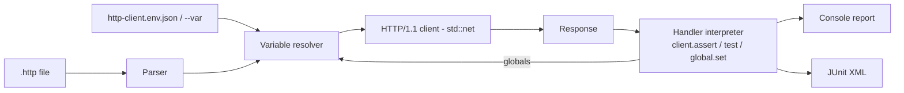

# reqrun

[English](README.md) | [中文](README.zh.md) | [日本語](README.ja.md)

[](LICENSE) [](Cargo.toml) [](CHANGELOG.md)  [](CONTRIBUTING.md)

**reqrun：オープンソースの .http ファイル CI ランナー — エディタが既に理解している JetBrains 形式のリクエストファイルを、アサーションと環境切り替え付きで実行。依存ゼロの静的バイナリ 1 つ。**


```bash
git clone https://github.com/JaydenCJ/reqrun.git && cargo install --path reqrun
```

> プレリリース：v0.1.0 はまだ crates.io に公開されていません。上記の通りソースからインストールしてください。純粋な `std` 実装 — ビルドが取り込む依存はゼロです。

## なぜ reqrun？

`.http` ファイルは何千ものリポジトリに存在します。IntelliJ・WebStorm・VS Code REST Client が、コードの隣に API を記述するデファクトの方法にしました。しかし*実行*できるのはエディタの中だけ — 同じチェックを CI に載せたくなった瞬間、チームはすべてを curl スクリプトや Postman コレクション、Hurl 独自形式に書き直すことになります。その書き直しこそがバグの温床：真実の源が 2 つになり、少しずつ乖離していきます。reqrun は逆に賭けます — エディタが既に理解しているまさにそのファイルを、同じ `###` 区切り、`# @name` ディレクティブ、`{{variables}}`、`http-client.env.json` 環境、`> ` レスポンスハンドラごと実行し、アサーション単位の結果・JUnit XML 出力・意味のある終了コードを備えた CI ゲートに変えます。

| | reqrun | Hurl | httpyac | JetBrains `ijhttp` |
|---|---|---|---|---|
| ファイル形式 | リポジトリに既にある `.http` ファイル | 独自の `.hurl` DSL（書き直しが必要） | `.http`（スーパーセット） | `.http` |
| ランタイムの重さ | 静的バイナリ 1 つ、**依存ゼロ** | バイナリ + libcurl | Node.js ≥18 + npm ツリー | JVM |
| アサーション | JetBrains ハンドラのサブセットをネイティブ解釈 | 独自 asserts セクション | フル JavaScript VM | フル JavaScript VM |
| `http-client.env.json` 環境 | 対応、private ファイル込み | 非対応（独自変数） | 対応 | 対応 |
| 失敗時の詳細 | アサーション単位の PASS/FAIL + 式のソース | アサーション単位 | テスト単位 | テスト単位 |
| CI 向け JUnit レポート | 対応（`--report`） | 対応 | 対応 | 対応 |
| HTTPS | 未対応 — v0.1.0 は素の HTTP/1.1 のみ（ロードマップ参照） | 対応 | 対応 | 対応 |

<sub>比較は 2026-07 時点の各上流ドキュメントに基づく。Hurl は優れたランナーです — ただし自分の形式専用；reqrun の存在意義は「編集するファイルが CI の実行するファイルそのもの」であることです。</sub>

## 特徴

- **エディタの形式をそのまま** — `###` 区切り、`# @name`、`# @no-redirect`、ファイルレベル `@variables`、複数行 URL クエリ継続、`< file` / `<@ file` ボディ、`>> file` レスポンス保存：ファイルは IntelliJ でも VS Code でも変更なしに使い続けられます。
- **JavaScript エンジン不要のアサーション** — `client.test` / `client.assert` / `client.global.set` / `client.log` のハンドラサブセットをネイティブ解釈。`response.status`、`response.body` の JSON アクセス、`response.headers.valueOf(...)`、文字列ヘルパー、`+` 連結、`&&`/`||` に対応；サブセット外の記述は黙って通らず、はっきりエラーになります。
- **リクエストの連鎖** — あるリクエストで `client.global.set("token", response.body.token)`、次のリクエストで `Authorization: Bearer {{token}}`；グローバル値は同一実行内でファイルをまたいで保持され、`login.http` がスイート全体に注入できます。
- **JetBrains 流の環境管理** — 各ファイルの隣の `http-client.env.json` を自動発見（`http-client.private.env.json` の上書きも）、`--env staging` で選択、実行ごとに `--var host=127.0.0.1` で上書き可能。
- **CI のための作り** — 終了コード `0/1/2`（成功 / 失敗あり / 使い方エラー）、`--report` で JUnit XML、`--fail-fast`、アサーションなしリクエストを 4xx/5xx で落とす `--strict`、オフライン検証用の `--dry-run`/`--list`。
- **依存ゼロ・テレメトリゼロ** — 純 Rust `std`：自前の `.http` パーサ、HTTP/1.1 クライアント、JSON パーサ、ハンドラインタプリタ；reqrun が接続するのはファイルに書かれたホストだけで、それ以外は何もありません。93 個のオフラインテストとエンドツーエンドのスモークスクリプトで検証済み。

## クイックスタート

インストール（Rust 1.75+ が必要）：

```bash
git clone https://github.com/JaydenCJ/reqrun.git && cargo install --path reqrun
```

同梱サンプルを実行 — ヘルスチェック、ログイン、そして `client.global.set` で連鎖するトークン認証リクエスト（スモークスクリプトが対応するデモ API を `127.0.0.1:39642` に起動します）：

```bash
reqrun examples/quickstart.http --env local
```

出力（実際の実行から取得）：

```text
examples/quickstart.http
  PASS  health (200 OK, 1ms) [2/2 checks]
  PASS  login (200 OK, 0ms) [1/1 checks]
  PASS  whoami (200 OK, 0ms) [2/2 checks]
3 request(s): 3 passed, 0 failed — 5 check(s)
```

アサーションが失敗すると、どのチェックか・式は何かが表示され、終了コード 1 を返します：

```text
pin.http
  FAIL  request #1 (200 OK, 0ms) [0/1 checks]
        not ok version pinned (assert: response.body.version === "9.9.9")
1 request(s): 0 passed, 1 failed — 1 check(s)
```

`--report junit.xml` を付けて CI にそのファイルを読ませれば、各リクエストがテストケースになります。

## CLI リファレンス

| フラグ | デフォルト | 効果 |
|---|---|---|
| `--env NAME` | なし | `http-client.env.json`（+ private ファイル）から環境を選択 |
| `--env-file PATH` | 自動発見 | 各 `.http` ファイルの隣のものの代わりに env ファイルを明示指定 |
| `--var K=V` | — | 変数を設定/上書き（繰り返し可；他のどの供給源よりも優先） |
| `--request NAME` | 全部 | 指定した名前のリクエストのみ実行（繰り返し可） |
| `--timeout DUR` | `30s` | リクエストごとの接続/読み取りタイムアウト（`500ms`、`5s`、`2m`） |
| `--strict` | オフ | アサーションのないリクエストをステータス ≥ 400 で失敗扱い |
| `--fail-fast` | オフ | 最初の失敗で停止；残りのリクエストはスキップとして報告 |
| `--dry-run` | オフ | 変数を解決してワイヤリクエストを表示、何も送信しない |
| `--list` | オフ | 実行せずにリクエスト名とメソッドを一覧表示 |
| `--report PATH` | なし | CI 向けの JUnit XML レポートを書き出す |
| `--verbose` | オフ | レスポンスヘッダと成功したチェックを表示（失敗と `client.log` は常に表示） |
| `--no-color` | オフ | ANSI カラーを無効化（`NO_COLOR` にも従う） |

終了コード：`0` すべて成功 · `1` 失敗またはエラーのリクエストが 1 つ以上 · `2` 使い方・パース・環境のエラー。

## 対応ハンドラサブセット

レスポンスハンドラは JavaScript VM なしで動きます。reqrun は実際の `.http` ファイルが CI チェックに使う呼び出しをネイティブ解釈します。非対応の構文は位置付きエラーになります — 実行できないチェックが緑に見えることは決してありません。

| 構文 | 補足 |
|---|---|
| `client.test(name, function () { ... })` | アサーションをグループ化；`() => { ... }` も可 |
| `client.assert(expr[, message])` | 失敗時はメッセージと式のソースを表示 |
| `client.global.set(name, expr)` | 捕捉した値は後続リクエスト/ファイルの `{{name}}` になる |
| `client.log(expr)` | 対応するリクエストの結果行の下に表示 |
| `response.status`、`response.body`、`response.headers.valueOf/valuesOf`、`response.contentType.mimeType/charset` | レスポンスが JSON なら `response.body` はパース済み JSON |
| `===` `!==` `==` `!=` `>` `>=` `<` `<=` `+` `&&` `\|\|` `!`、`.includes/.startsWith/.endsWith/.length`、`[index]`/`["key"]` | 真偽値判定を含む JS ライクな意味論；`+` は数値加算または文字列連結 |

動的変数：`{{$uuid}}`、`{{$timestamp}}`、`{{$isoTimestamp}}`、`{{$randomInt}}`、`{{$random.integer(a, b)}}`、`{{$env.NAME}}`。

## アーキテクチャ



## ロードマップ

- [x] コアランナー：JetBrains `.http` パーサ、環境 + private env ファイル、変数/動的変数の解決、std のみの HTTP/1.1 クライアント（リダイレクト対応）、ハンドラサブセットのインタプリタ、リクエスト連鎖、コンソール + JUnit レポート、`--dry-run`/`--list`/`--strict`/`--fail-fast`
- [ ] HTTPS 対応（TLS は依存導入を検討する唯一の箇所、feature flag の背後に）
- [ ] Cookie jar と `# @no-cookie-jar`
- [ ] `multipart/form-data` と GraphQL リクエストボディ
- [ ] 不安定なエンドポイント向けのリクエスト単位リトライ/リピート注釈
- [ ] `--jobs` によるファイル並列実行

完全なリストは [open issues](https://github.com/JaydenCJ/reqrun/issues) を参照。

## コントリビュート

コントリビュート歓迎です — [CONTRIBUTING.md](CONTRIBUTING.md) を読み、[good first issue](https://github.com/JaydenCJ/reqrun/issues?q=is%3Aissue+is%3Aopen+label%3A%22good+first+issue%22) から始めるか、[discussion](https://github.com/JaydenCJ/reqrun/discussions) を開いてください。このリポジトリは CI を同梱しません；上記のすべての主張はローカルでの `cargo test`（93 テスト）と `scripts/smoke.sh`（`SMOKE OK` を表示すること）の実行で検証されています。

## ライセンス

[MIT](LICENSE)
