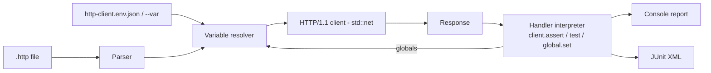

# reqrun

[English](README.md) | [中文](README.zh.md) | [日本語](README.ja.md)

[](LICENSE) [](Cargo.toml) [](CHANGELOG.md)  [](CONTRIBUTING.md)

**reqrun：an open-source CI runner for the .http files your editor already understands — JetBrains-style requests, assertions and environments, one zero-dependency static binary.**


```bash
git clone https://github.com/JaydenCJ/reqrun.git && cargo install --path reqrun
```

> Pre-release: v0.1.0 is not yet on crates.io; install from source as above. Pure `std` — the build pulls in zero dependencies.

## Why reqrun?

`.http` files live in thousands of repos: IntelliJ, WebStorm and the VS Code REST Client made them the de-facto way to document an API next to its code. But they only *run* inside an editor — the moment you want the same checks in CI, teams rewrite everything into curl scripts, Postman collections, or Hurl's own format. That rewrite is the bug: two sources of truth that drift apart. reqrun takes the opposite bet — it executes the exact files your editor already understands, with the same `###` separators, `# @name` directives, `{{variables}}`, `http-client.env.json` environments and `> ` response handlers, and turns them into a CI gate with per-assertion results, JUnit XML output and meaningful exit codes.

| | reqrun | Hurl | httpyac | JetBrains `ijhttp` |
|---|---|---|---|---|
| File format | the `.http` files already in your repo | its own `.hurl` DSL (rewrite required) | `.http` (superset) | `.http` |
| Runtime footprint | one static binary, **zero dependencies** | binary + libcurl | Node.js ≥18 + npm tree | JVM |
| Assertions | JetBrains handler subset, interpreted natively | own asserts section | full JavaScript VM | full JavaScript VM |
| `http-client.env.json` environments | yes, including the private file | no (own vars) | yes | yes |
| Failure detail | per-assertion PASS/FAIL + expression source | per-assert | per-test | per-test |
| JUnit report for CI | yes (`--report`) | yes | yes | yes |
| HTTPS | not yet — v0.1.0 speaks plain HTTP/1.1 (see roadmap) | yes | yes | yes |

<sub>Comparison reflects upstream documentation as of 2026-07. Hurl is an excellent runner — for its own format; reqrun exists so the file you edit is the file CI runs.</sub>

## Features

- **Your editor's format, verbatim** — `###` separators, `# @name`, `# @no-redirect`, file `@variables`, multi-line URL query continuation, `< file` / `<@ file` bodies, `>> file` response capture: files keep working in IntelliJ and VS Code, unchanged.
- **Assertions without a JavaScript engine** — the `client.test` / `client.assert` / `client.global.set` / `client.log` handler subset is interpreted natively with `response.status`, `response.body` JSON access, `response.headers.valueOf(...)`, string helpers, `+` concatenation and `&&`/`||`; anything outside the subset fails loudly instead of passing silently.
- **Request chaining** — `client.global.set("token", response.body.token)` in one request, `Authorization: Bearer {{token}}` in the next; globals persist across files in one invocation, so `login.http` can feed a whole suite.
- **Environments the JetBrains way** — `http-client.env.json` discovered next to each file (plus `http-client.private.env.json` overrides), selected with `--env staging`, overridable per-run with `--var host=127.0.0.1`.
- **Built for CI** — exit codes `0/1/2` (pass / failures / usage), JUnit XML via `--report`, `--fail-fast`, `--strict` to fail assertion-less requests on 4xx/5xx, and `--dry-run`/`--list` for offline validation.
- **Zero dependencies, zero telemetry** — pure Rust `std`: hand-rolled `.http` parser, HTTP/1.1 client, JSON parser and handler interpreter; reqrun talks to the hosts in your files and nothing else, verified by 93 offline tests plus an end-to-end smoke script.

## Quickstart

Install (requires Rust 1.75+):

```bash
git clone https://github.com/JaydenCJ/reqrun.git && cargo install --path reqrun
```

Run the shipped example — a health check, a login, then a token-authenticated request chained via `client.global.set` (the smoke script starts a matching demo API on `127.0.0.1:39642`):

```bash
reqrun examples/quickstart.http --env local
```

Output (captured from a real run):

```text
examples/quickstart.http
  PASS  health (200 OK, 1ms) [2/2 checks]
  PASS  login (200 OK, 0ms) [1/1 checks]
  PASS  whoami (200 OK, 0ms) [2/2 checks]
3 request(s): 3 passed, 0 failed — 5 check(s)
```

When an assertion fails, you see which check, the expression, and get exit code 1:

```text
pin.http
  FAIL  request #1 (200 OK, 0ms) [0/1 checks]
        not ok version pinned (assert: response.body.version === "9.9.9")
1 request(s): 0 passed, 1 failed — 1 check(s)
```

Add `--report junit.xml` and point your CI at the file — every request becomes a test case.

## CLI reference

| Flag | Default | Effect |
|---|---|---|
| `--env NAME` | none | Select an environment from `http-client.env.json` (+ private file) |
| `--env-file PATH` | auto-discovered | Explicit env file instead of the one next to each `.http` file |
| `--var K=V` | — | Set/override a variable (repeatable; beats every other source) |
| `--request NAME` | all | Run only the named request(s) (repeatable) |
| `--timeout DUR` | `30s` | Per-request connect/read timeout (`500ms`, `5s`, `2m`) |
| `--strict` | off | Requests without assertions fail on status ≥ 400 |
| `--fail-fast` | off | Stop at the first failure; remaining requests are reported skipped |
| `--dry-run` | off | Resolve variables, print the wire requests, send nothing |
| `--list` | off | List request names and methods without running |
| `--report PATH` | none | Write a JUnit XML report for CI |
| `--verbose` | off | Show response heads and passing checks (failures and `client.log` always print) |
| `--no-color` | off | Disable ANSI colors (also honors `NO_COLOR`) |

Exit codes: `0` all passed · `1` at least one request failed or errored · `2` usage, parse or environment error.

## Supported handler subset

Response handlers run without a JavaScript VM; reqrun interprets the calls real `.http` files use for CI checks. Unsupported constructs are a positioned error — a check that cannot run never looks green.

| Construct | Notes |
|---|---|
| `client.test(name, function () { ... })` | groups assertions; `() => { ... }` also accepted |
| `client.assert(expr[, message])` | failure shows your message plus the expression source |
| `client.global.set(name, expr)` | captured value becomes `{{name}}` for later requests/files |
| `client.log(expr)` | printed under the request's result line |
| `response.status`, `response.body`, `response.headers.valueOf/valuesOf`, `response.contentType.mimeType/charset` | `response.body` is parsed JSON when the response is JSON |
| `===` `!==` `==` `!=` `>` `>=` `<` `<=` `+` `&&` `\|\|` `!`, `.includes/.startsWith/.endsWith/.length`, `[index]`/`["key"]` | JS-like semantics, including truthiness; `+` adds numbers or concatenates strings |

Dynamic variables: `{{$uuid}}`, `{{$timestamp}}`, `{{$isoTimestamp}}`, `{{$randomInt}}`, `{{$random.integer(a, b)}}`, `{{$env.NAME}}`.

## Architecture



## Roadmap

- [x] Core runner: JetBrains `.http` parser, environments + private env files, variable/dynamic-variable resolution, std-only HTTP/1.1 client with redirects, handler-subset interpreter, request chaining, console + JUnit reports, `--dry-run`/`--list`/`--strict`/`--fail-fast`
- [ ] HTTPS support (TLS is the one place a dependency will be considered, behind a feature flag)
- [ ] Cookie jar and `# @no-cookie-jar`
- [ ] `multipart/form-data` and GraphQL request bodies
- [ ] Per-request retry/repeat annotations for flaky-endpoint tolerance
- [ ] Parallel file execution with `--jobs`

See the [open issues](https://github.com/JaydenCJ/reqrun/issues) for the full list.

## Contributing

Contributions are welcome — see [CONTRIBUTING.md](CONTRIBUTING.md), start with a [good first issue](https://github.com/JaydenCJ/reqrun/issues?q=is%3Aissue+is%3Aopen+label%3A%22good+first+issue%22) or open a [discussion](https://github.com/JaydenCJ/reqrun/discussions). This repository ships no CI; every claim above is verified by local runs of `cargo test` (93 tests) and `scripts/smoke.sh` (must print `SMOKE OK`).

## License

[MIT](LICENSE)
