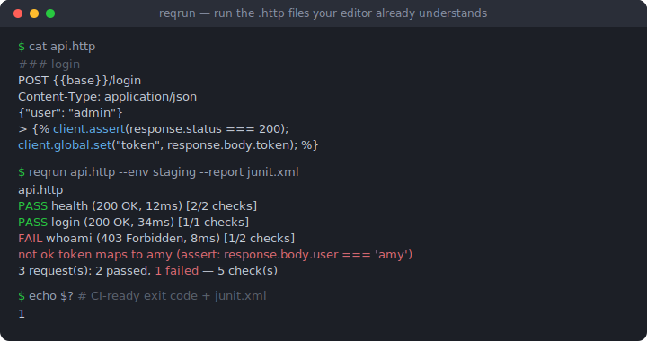
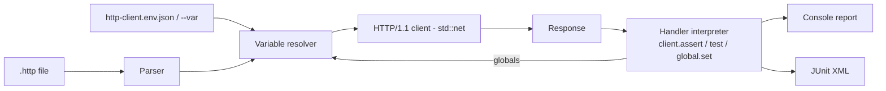

# reqrun

[English](README.md) | [中文](README.zh.md) | [日本語](README.ja.md)

[](LICENSE) [](Cargo.toml) [](CHANGELOG.md)  [](CONTRIBUTING.md)

**reqrun：开源的 .http 文件 CI 运行器——直接执行你的编辑器早已理解的 JetBrains 风格请求文件，带断言与环境支持，一个零依赖静态二进制。**



```bash
git clone https://github.com/JaydenCJ/reqrun.git && cargo install --path reqrun
```

> 预发布：v0.1.0 尚未发布到 crates.io，请按上述方式从源码安装。纯 `std` 实现——构建过程零依赖。

## 为什么选 reqrun？

`.http` 文件存在于成千上万的仓库里：IntelliJ、WebStorm 和 VS Code REST Client 让它成为在代码旁记录 API 的事实标准。但它们只能在编辑器里*运行*——一旦想把同样的检查放进 CI，团队就得把一切重写成 curl 脚本、Postman 集合或 Hurl 自己的格式。重写本身就是 bug：两份事实来源会逐渐漂移。reqrun 押注相反的方向——直接执行你的编辑器早已理解的那份文件，同样的 `###` 分隔符、`# @name` 指令、`{{variables}}`、`http-client.env.json` 环境和 `> ` 响应处理器，并把它变成带逐断言结果、JUnit XML 输出和有意义退出码的 CI 关卡。

| | reqrun | Hurl | httpyac | JetBrains `ijhttp` |
|---|---|---|---|---|
| 文件格式 | 仓库里已有的 `.http` 文件 | 自创的 `.hurl` DSL（需要重写） | `.http`（超集） | `.http` |
| 运行时体积 | 单个静态二进制，**零依赖** | 二进制 + libcurl | Node.js ≥18 + npm 依赖树 | JVM |
| 断言 | JetBrains 处理器子集，原生解释执行 | 自有 asserts 段 | 完整 JavaScript VM | 完整 JavaScript VM |
| `http-client.env.json` 环境 | 支持，含 private 文件 | 不支持（自有变量） | 支持 | 支持 |
| 失败细节 | 逐断言 PASS/FAIL + 表达式源码 | 逐断言 | 逐测试 | 逐测试 |
| 面向 CI 的 JUnit 报告 | 支持（`--report`） | 支持 | 支持 | 支持 |
| HTTPS | 暂不支持——v0.1.0 只说纯 HTTP/1.1（见路线图） | 支持 | 支持 | 支持 |

<sub>对比基于 2026-07 各上游文档。Hurl 是一个出色的运行器——但只针对它自己的格式；reqrun 的存在意义是：你编辑的文件就是 CI 运行的文件。</sub>

## 特性

- **原样支持编辑器的格式** — `###` 分隔符、`# @name`、`# @no-redirect`、文件级 `@variables`、多行 URL 查询续行、`< file` / `<@ file` 请求体、`>> file` 响应保存：文件在 IntelliJ 和 VS Code 里继续原样可用。
- **不需要 JavaScript 引擎的断言** — 原生解释 `client.test` / `client.assert` / `client.global.set` / `client.log` 处理器子集，支持 `response.status`、`response.body` JSON 访问、`response.headers.valueOf(...)`、字符串辅助方法、`+` 拼接和 `&&`/`||`；子集之外的写法会大声报错而不是默默通过。
- **请求串联** — 在一个请求里 `client.global.set("token", response.body.token)`，下一个请求写 `Authorization: Bearer {{token}}`；全局值在同一次调用内跨文件保留，`login.http` 可以喂饱整个套件。
- **JetBrains 式环境管理** — 自动发现每个文件旁的 `http-client.env.json`（外加 `http-client.private.env.json` 覆盖），用 `--env staging` 选择，单次运行可用 `--var host=127.0.0.1` 覆盖。
- **为 CI 而生** — 退出码 `0/1/2`（通过 / 有失败 / 用法错误），`--report` 输出 JUnit XML，`--fail-fast`，`--strict` 让无断言请求在 4xx/5xx 时失败，`--dry-run`/`--list` 支持离线校验。
- **零依赖、零遥测** — 纯 Rust `std`：手写的 `.http` 解析器、HTTP/1.1 客户端、JSON 解析器和处理器解释器；reqrun 只连接你文件里写的主机，别无其他，由 93 个离线测试加端到端冒烟脚本验证。

## 快速开始

安装（需要 Rust 1.75+）：

```bash
git clone https://github.com/JaydenCJ/reqrun.git && cargo install --path reqrun
```

运行随附示例——健康检查、登录、再用 `client.global.set` 串联一个带令牌认证的请求（冒烟脚本会在 `127.0.0.1:39642` 启动配套的演示 API）：

```bash
reqrun examples/quickstart.http --env local
```

输出（取自真实运行）：

```text
examples/quickstart.http
  PASS  health (200 OK, 1ms) [2/2 checks]
  PASS  login (200 OK, 0ms) [1/1 checks]
  PASS  whoami (200 OK, 0ms) [2/2 checks]
3 request(s): 3 passed, 0 failed — 5 check(s)
```

断言失败时，你能看到是哪条检查、对应表达式，并得到退出码 1：

```text
pin.http
  FAIL  request #1 (200 OK, 0ms) [0/1 checks]
        not ok version pinned (assert: response.body.version === "9.9.9")
1 request(s): 0 passed, 1 failed — 1 check(s)
```

加上 `--report junit.xml` 并让 CI 读取该文件——每个请求都会变成一个测试用例。

## CLI 参考

| 选项 | 默认值 | 作用 |
|---|---|---|
| `--env NAME` | 无 | 从 `http-client.env.json`（+ private 文件）选择环境 |
| `--env-file PATH` | 自动发现 | 指定 env 文件，替代每个 `.http` 文件旁的那个 |
| `--var K=V` | — | 设置/覆盖变量（可重复；优先级最高） |
| `--request NAME` | 全部 | 只运行指定名称的请求（可重复） |
| `--timeout DUR` | `30s` | 每请求连接/读取超时（`500ms`、`5s`、`2m`） |
| `--strict` | 关 | 无断言的请求在状态码 ≥ 400 时判定失败 |
| `--fail-fast` | 关 | 首个失败即停止；其余请求标记为跳过 |
| `--dry-run` | 关 | 解析变量、打印线上请求报文，不发送任何数据 |
| `--list` | 关 | 只列出请求名称和方法，不运行 |
| `--report PATH` | 无 | 写出面向 CI 的 JUnit XML 报告 |
| `--verbose` | 关 | 显示响应头和通过的检查（失败与 `client.log` 始终打印） |
| `--no-color` | 关 | 禁用 ANSI 颜色（同样遵循 `NO_COLOR`） |

退出码：`0` 全部通过 · `1` 至少一个请求失败或出错 · `2` 用法、解析或环境错误。

## 支持的处理器子集

响应处理器无需 JavaScript VM；reqrun 原生解释真实 `.http` 文件里用于 CI 检查的那些调用。不支持的写法会得到带位置的报错——跑不起来的检查绝不显示为绿色。

| 语法 | 说明 |
|---|---|
| `client.test(name, function () { ... })` | 为断言分组；也接受 `() => { ... }` |
| `client.assert(expr[, message])` | 失败时显示你的消息及表达式源码 |
| `client.global.set(name, expr)` | 捕获的值成为后续请求/文件里的 `{{name}}` |
| `client.log(expr)` | 打印在对应请求的结果行下方 |
| `response.status`、`response.body`、`response.headers.valueOf/valuesOf`、`response.contentType.mimeType/charset` | 响应为 JSON 时 `response.body` 为解析后的 JSON |
| `===` `!==` `==` `!=` `>` `>=` `<` `<=` `+` `&&` `\|\|` `!`、`.includes/.startsWith/.endsWith/.length`、`[index]`/`["key"]` | 类 JS 语义，含真值判定；`+` 做数字相加或字符串拼接 |

动态变量：`{{$uuid}}`、`{{$timestamp}}`、`{{$isoTimestamp}}`、`{{$randomInt}}`、`{{$random.integer(a, b)}}`、`{{$env.NAME}}`。

## 架构



## 路线图

- [x] 核心运行器：JetBrains `.http` 解析器、环境 + private env 文件、变量/动态变量解析、纯 std 的 HTTP/1.1 客户端（含重定向）、处理器子集解释器、请求串联、控制台 + JUnit 报告、`--dry-run`/`--list`/`--strict`/`--fail-fast`
- [ ] HTTPS 支持（TLS 是唯一会考虑引入依赖的地方，将放在 feature flag 后面）
- [ ] Cookie jar 与 `# @no-cookie-jar`
- [ ] `multipart/form-data` 与 GraphQL 请求体
- [ ] 针对不稳定端点的逐请求重试/重复注解
- [ ] `--jobs` 并行执行多个文件

完整列表见 [open issues](https://github.com/JaydenCJ/reqrun/issues)。

## 参与贡献

欢迎贡献——请阅读 [CONTRIBUTING.md](CONTRIBUTING.md)，从 [good first issue](https://github.com/JaydenCJ/reqrun/issues?q=is%3Aissue+is%3Aopen+label%3A%22good+first+issue%22) 入手，或发起一个 [discussion](https://github.com/JaydenCJ/reqrun/discussions)。本仓库不携带 CI；上述所有声明都由本地运行 `cargo test`（93 个测试）和 `scripts/smoke.sh`（必须打印 `SMOKE OK`）验证。

## 许可证

[MIT](LICENSE)
